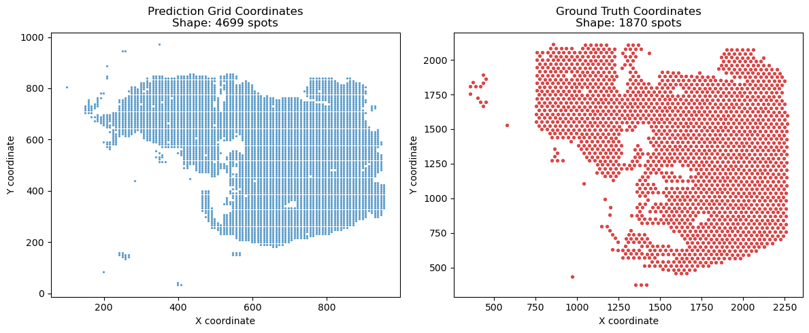
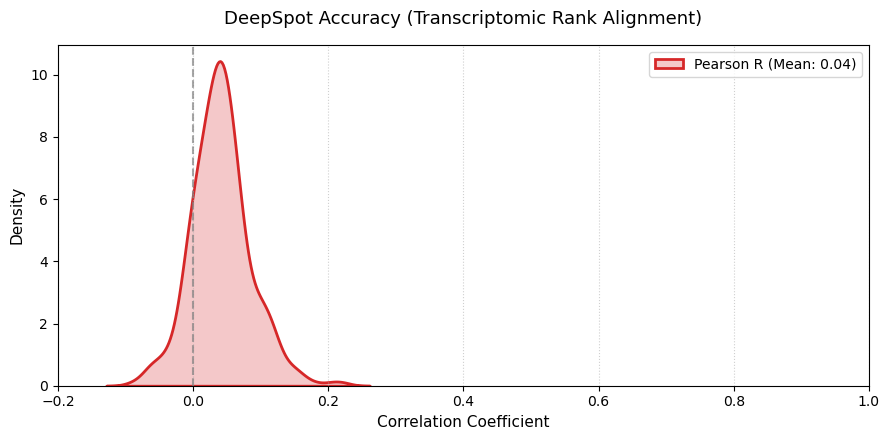
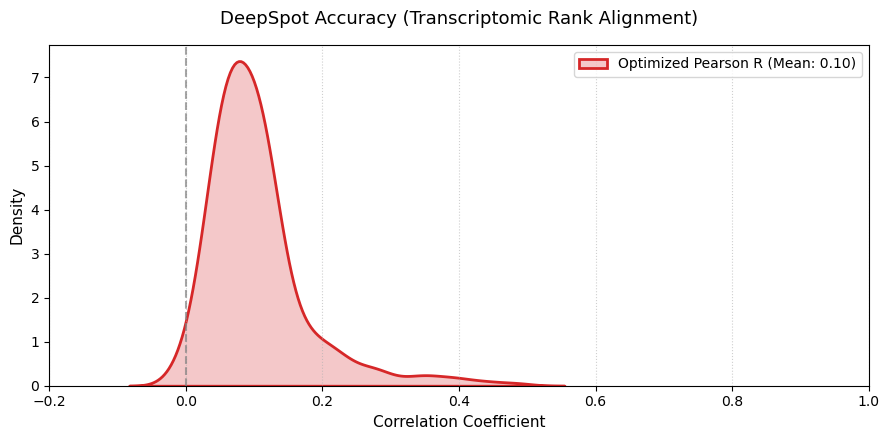

# Validation of DeepSpot Predictions Against 10x Visium Ground Truth (Sample KC2)

## Overview

This notebook presents a validation pipeline for assessing the spatial and transcriptional fidelity of gene expression predictions generated by the DeepSpot model, using paired 10x Visium spatial transcriptomics data from sample **KC2** as ground truth.

The prediction output and the Visium ground truth are acquired on distinct spatial grids (4,699 prediction spots versus 1,870 Visium spots) and over non-identical gene panels (5,000 versus 17,845 genes). The pipeline therefore addresses three sequential problems: (i) reconciling the gene spaces of the two datasets, (ii) establishing a correspondence between the two spatial coordinate systems, and (iii) quantifying the agreement between predicted and observed expression on a per-gene basis. Two alignment strategies are compared — a purely geometric (spatial) alignment and an expression-driven refinement based on transcriptomic similarity — to characterize the extent to which spatial registration alone limits predictive accuracy.

## Data

| Object | File | Description |
|---|---|---|
| Ground truth | `KC2.h5ad` | Preprocessed 10x Visium spatial transcriptomics data (1,870 spots × 17,845 genes) |
| Prediction | `KC2_83_geneCount.h5ad` | DeepSpot model output on a denser prediction grid (4,699 spots × 5,000 genes) |

Expected file locations (relative to the notebook):

```
../TLS_VISIUM_USZ/h5ad_preprocessed/KC2.h5ad
./KC2_83_geneCount.h5ad
```

## Methodology

The validation proceeds through twelve steps, summarized below.

**1–3. Data loading and gene-space harmonization.** Both AnnData objects are loaded with ScanPy, their dimensions are inspected, and the intersection of gene identifiers is computed. Both objects are subset to this common gene set (5,000 genes) to ensure that all subsequent comparisons are performed on identical features.

**4. Coordinate visualization.** The spatial coordinates of the prediction grid and the Visium grid are plotted side by side as an initial diagnostic, revealing that the two coordinate systems differ in scale, orientation, and origin and therefore require explicit registration before comparison.

**5. Normalization.** The maximum expression values of both objects are inspected to assess whether the ground truth data are stored as raw counts. Where this is the case, total-count normalization (`normalize_total`) followed by log1p transformation is applied to bring the ground truth onto a scale comparable to the (already log-normalized) predictions.

**6. Geometric alignment via Procrustes analysis and KNN aggregation.** A correspondence between the prediction grid and the Visium grid is established in two stages. First, an initial nearest-neighbor matching identifies anchor point pairs between the two coordinate systems, and Procrustes analysis is used to derive the optimal similarity transformation (translation, rotation, and isotropic scaling) mapping prediction coordinates onto Visium coordinates. This transformation is computed via singular value decomposition and applied to all 4,699 prediction spots. Second, for each Visium spot, the five nearest transformed prediction spots (k = 5) are identified and their expression profiles are averaged, yielding a prediction matrix aligned to the Visium spatial grid. The aligned predictions and the normalized ground truth are packaged into a single AnnData object as the `predicted` and `ground_truth` layers, respectively.

**7. Verification.** The dimensions of the aligned objects are confirmed to match (1,870 spots × 5,000 genes for both).

**8. Gene filtering.** Two complementary filtering criteria are applied to restrict downstream evaluation to informative genes: a detection-rate threshold retaining genes expressed in at least 10% of spots (yielding 370 genes), and selection of the top 1,000 highly variable genes (HVGs) from the ground truth layer using the Seurat method.

**9. Per-gene correlation under spatial alignment.** For each of the 370 genes passing the detection threshold, the Pearson correlation coefficient between ground truth and spatially-aligned predicted expression is computed across all 1,870 spots. The resulting distribution of correlation coefficients is visualized as a kernel density estimate.

**10. Expression-driven alignment via cosine similarity.** To assess whether the spatial registration in Step 6 is limiting accuracy, an alternative correspondence is constructed using transcriptomic similarity rather than spatial proximity. Restricting to the top 2,000 HVGs, a cosine similarity matrix is computed between each ground truth spot and all prediction spots. For each ground truth spot, the three prediction spots with the highest transcriptomic similarity are averaged to form a `predicted_optimized` expression profile.

**11. Per-gene correlation under expression-driven alignment.** The per-gene Pearson correlation analysis from Step 9 is repeated using the `predicted_optimized` layer, allowing direct comparison against the spatially-aligned baseline.

**12. Identification of top-performing genes.** The ten genes with the highest Pearson correlation under the optimized alignment are reported, characterizing which transcriptional programs are most faithfully recovered by the model.

## Results

### Spatial coordinate systems prior to alignment

The prediction grid (4,699 spots) and the Visium ground truth grid (1,870 spots) occupy non-overlapping coordinate ranges and orientations, motivating the Procrustes-based registration described in Step 6.



### Per-gene correlation under spatial alignment

The distribution of per-gene Pearson correlation coefficients obtained using Procrustes-aligned, KNN-aggregated predictions (Step 9) is centered close to zero, indicating weak agreement between predicted and observed expression at the level of individual genes when spots are matched by spatial position alone.



| Metric | Value |
|---|---|
| Genes evaluated | 370 |
| Mean Pearson R | 0.0407 |

### Per-gene correlation under expression-driven alignment

When the spot correspondence is instead derived from transcriptomic similarity (Steps 10–11), the distribution of per-gene correlations shifts toward higher values, with the mean Pearson R approximately **2.6-fold** higher than under spatial alignment alone.



| Metric | Value |
|---|---|
| Genes evaluated | 370 |
| Mean Pearson R | 0.1043 |

### Top ten genes by predictive accuracy (optimized alignment)

| Rank | Gene | Pearson R |
|---|---|---|
| 1 | PTGDS | 0.4855 |
| 2 | JCHAIN | 0.4489 |
| 3 | ACTA2 | 0.4264 |
| 4 | CCN2 | 0.4003 |
| 5 | COL1A1 | 0.3956 |
| 6 | IGFBP7 | 0.3811 |
| 7 | COL1A2 | 0.3648 |
| 8 | TGFBI | 0.3527 |
| 9 | FN1 | 0.3466 |
| 10 | IGFBP3 | 0.3391 |

## Interpretation

The substantial increase in mean per-gene correlation under expression-driven alignment relative to spatial alignment alone (0.041 versus 0.104) suggests that the spatial registration between the prediction grid and the Visium grid is imprecise relative to the resolution at which expression varies, and that this registration error is a meaningful contributor to the apparent discrepancy between predicted and observed expression. The genes most accurately recovered under the optimized alignment — including stromal and extracellular matrix markers (COL1A1, COL1A2, FN1, ACTA2, TGFBI, IGFBP7, IGFBP3, CCN2) alongside the immunoglobulin-associated transcript JCHAIN and the lipocalin-type prostaglandin synthase PTGDS — predominantly reflect broad tissue-compartment gradients (for example, stromal versus epithelial regions) rather than fine-grained cell-type-specific transcriptional programs. Even under the optimized alignment, the overall mean correlation (R ≈ 0.10) remains modest, indicating that substantial discrepancy between predicted and observed expression persists beyond what can be attributed to spatial misregistration alone.

## Requirements

```bash
pip install scanpy numpy pandas scipy scikit-learn matplotlib seaborn
```

## Usage

1. Ensure the ground truth and prediction `.h5ad` files are available at the paths specified in the Data section (or update the paths in Step 1 accordingly).
2. Open `deepspot_visium_validation.ipynb` in Jupyter.
3. Execute all cells sequentially. Figures and summary statistics are produced inline as each step completes.

## Repository Structure

```
.
├── deepspot_visium_validation.ipynb
├── README.md
└── images/
    ├── spatial_coordinates_alignment.png
    ├── pearson_correlation_baseline.png
    └── pearson_correlation_optimized.png
```
